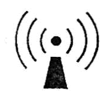

(guidelines)=
# Guidelines for Use

(guidelines/general)=
## General Guidelines

:::{Attention}
The device can only be operated by users with a base knowledge of programming and fundamental PC skills. It is essential that users read the full text of the instruction manual before operating the device.
:::

:::{Attention}
Before first use, you must ensure that the device is complete and in good condition. Any mechanical damage, spillage stains or similar faults require servicing. Under no circumstances can a faulty or damaged network cable be used.
:::

:::{Attention}
Using the us4R-lite™ out of its intended use, or any use that has not been delineated in this manual, will lower the effectiveness of measures put in place to protect the user from danger, and result in a decrease of safety levels.
:::
  
The ready to use setup consists of the **us4R-lite™** device, a host PC computer ({numref}`peripheral-desktop`), an LCD monitor and a set of cables.

```{figure} img/peripheral-desktop.png
:name: peripheral-desktop
View of the us4R-lite™ connected to the host PC with PCIe cables.
```

**As standard, a host PC, an LCD monitor, and ultrasound probes are not provided by the Manufacturer.**

The **us4R-lite™** enables the user to simultaneously connect one ultrasound probes (linear/phase/convex/row-column).

Ultrasound echo signals from the probe are digitized and streamed via high-speed data interface (PCIe or Thunderbolt) to the PC, and then further to the GPU cards. Data processing takes place in the CPU/GPUs.

The processed data can be presented graphically on an LCD monitor. 

:::{Caution}
Never unplug the probe from the device during transmission!
This can result in damage to the transmit section of the us4R-lite™ device!
:::

:::{Caution}
Do not turn off the host PC or the us4R-lite system during communication with it! In particular, turning off the PC or us4R-lite while running an imaging script, executing some custom TX/RX sequence, or after setting a high voltage may damage the ultrasound system.
:::
<!-- :::{Attention}
The device is not equipped with life functions monitoring or alarm systems. 
The us4R-lite™ is not designed to monitor life functions!
::: -->


## Conditions of storage and transport

-   temperature -10÷50°C,
-   relative humidity across the temperature range \< 90%,
-   atmospheric pressure 500÷1060 hPa

## Environmental conditions

The **us4R-lite™** is designed for use in the following conditions:

-   temperature of environment recommended 16 ÷ 26°C, allowable 10 ÷ 40°C
-   humidity across the range of allowable temperatures 30% ÷ 85%
-   atmospheric pressure 500 ÷ 1060 hPa
-   environment of II category surge strength (overvoltage)
-   $2^{nd}$ degree contamination environment
-   in closed rooms
-   up to 2000m above sea level.

## Manufacturer EMC recommendations



The device has limited immunity to electromagnetic interference and thus
should be kept as far as possible from its sources (such as mobile
phones) during work. If additional interference signals are present and
their elimination is not possible, the registered waveforms and digital
values should be ignored.

The device has no elements sensitive to a 50Hz/60Hz magnetic field.

**§ 15.105 Information to the user.**

~~This equipment has been tested and found to comply with the limits for a Class A digital device, pursuant to part 15 of the FCC Rules. These limits are designed to provide reasonable protection against harmful interference when the equipment is operated in a commercial environment. This equipment generates, uses, and can radiate radio frequency energy and, if not installed and used in accordance with the instruction manual, may cause harmful interference to radio communications. Operation of this equipment in a residential area is likely to cause harmful interference in which case the user will be required to correct the interference at his own expense.~~

## Other conditions and recommendations

It is advised that the device operate at room temperature and at
moderate humidity. Any mechanical shocks should be avoided.

:::{Caution}
The Manufacturer recommends that you contact the service and perform a technical inspection (at the Manufacturer or remotely) 
if you suspect that the device has been mechanically damaged or otherwise diverges from normal appearance.
:::
  
The sole service provider for this device is the Manufacturer, us4us Ltd.

The **us4R-lite™** is an electronic device and should be disposed of
according to existing regulations.


Production of this equipment required the extraction and use of natural
resources. The equipment may contain substances that could be harmful to
the environment or human health if improperly handled at the product's
end of life. To avoid release of such substances into the environment
and to reduce the use of natural resources, we encourage you to recycle
this product in an appropriate system that will ensure that most of the
materials are reused or recycled appropriately.

## Cleaning and maintenance of the device

The **us4R-lite™** device should be cleaned and disinfected according to
standard procedure. However, it is essential to take additional care not
to allow any liquids into the device, as this can lead to malfunction
and the need for servicing.

The cover of the device can be cleaned with a piece of dry cloth,
ensuring no liquids are transported inside.

:::{Caution}
You must ensure that no liquids find their way inside the device!
In case of suspected spillage or moisture inside the device, 
do not connect the device to a power source or attempt to  
turn it on, but contact technical service. 
:::

If the device will not be used over the course of two or more days, it
should be cleaned and left protected from accidental damage, spillage or
contamination at a safe location.
