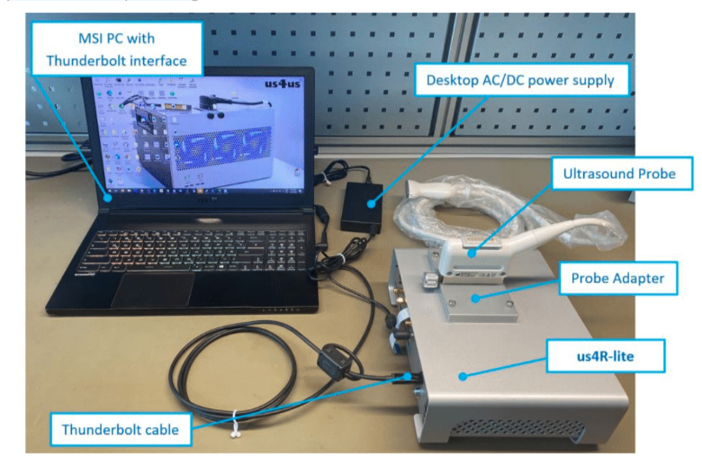
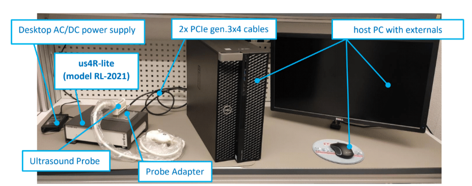

(hardware/general)=
# Hardware Description

## System Overview

The us4R-lite™ system is an ultrasound research device designed for transmission and acquisition of ultrasound signals using connected piezoceramic probes/transducers.

**The us4R-lite™ is a peripheral device thus always requires an external Host PC to work.**

An open-source ARRUS™ SDK (Software Development Kit) is provided to be installed and run on the host PC to execute User’s applications/scripting for device configuration, data acquisition, and custom processing.






(hardware/versions)=
## Hardware Models
The table below summarizes all hardware models of the us4R-lite™:

:::{list-table} us4R-lite™ Hardware Models
   :header-rows: 1

*   - Model
    - Options
    - External Interface
*   - RL_2020
    - +GPU (NO LONGER SUPPORTED)
    - Thunderbolt-3
*   - RL_2021
    - none
    - PCIe (2x gen3 4-lanes)
:::

(hardware/probe-adapters)=
## Ultrasound Probe Adapters
Us4R-lite™ research system features user-changeable ultrasound probe adapters.
Currently, we offer the following adapters:
* EPA (Esaote compatible)
* PAU (Ultrasonix compatible)
* VPA (ATL/Philips compatible)
* Custom Probe Adapter (on request)

:::{Note}
The system is supplied with one selected probe adapter. 
Additional adapters can be purchased separately.
:::


## Inputs and outputs

The **us4R-lite™** is equipped with:

-   a single probe connector,
-   2x PCIe ports or Thunderbolt-3 port (see {numref}`us4r-lite-pcie-back`),
-   2x digital inputs (TRIG-IN, CLK-IN),
-   2x digital outputs (TRIG-OUT, CLK-OUT),
-   1x DC power input.

```{figure} img/us4r-lite-pcie-back.jpg
:name: us4r-lite-pcie-back
:alt: Back-side of the us4R-lite™ device with PCIe interface. 
Back-side of the us4R-lite™ device with PCIe interface.
```

**PLEASE NOTE:** External devices should be connected via cables no longer than 3m.

(power-switch)=
## Power adapter and ON/OFF button

The power adapter connection is shown in the picture below ({numref}`us4r-lite-power`).

```{figure} img/us4r-lite-power.jpg
:name: us4r-lite-power
The us4R-lite™ DC power connector and ON/OFF button.
```

## Connecting ultrasound probes

Ultrasound probes require special care, as they can be easily damaged by any impact. The damaged transducers could have internal element short-circuits or open-circuits, both can cause malfunction or even
breakdown of the **us4R-lite™** transmit circuitry. 
**Therefore, it is vital that the probes are handled with extreme care and defective probes are never connected to the system.**

Probes should be disconnected from the device during the transport.

The ultrasound probe connector is situated on the top of the device.

```{figure} img/us4r-lite-probe-conn.jpg
:alt: Top-view of the us4R-lite™ with probe connector (linear/phase/convex/RCA).
Top-view of the us4R-lite™ with probe connector (linear/phase/convex/RCA).
```

A video instruction on how to change the probe adapter is available on our YouTube channel:

[](https://www.youtube.com/watch?v=v9DwhbGclBE)

**PLEASE NOTE:** Only a probe prepared and configured for use with the **us4R-lite™** can be connected to the device. For assistance, please contact the Manufacturer.

```{Caution}
Using non-compatible or broken probes can result in damage to the transmission section of the us4R-lite™!
Such damages are NOT covered under the warranty!
```

## PCIe ports 

The **us4R-lite™** is equipped with 2x PCIe gen3 x4 ports on the back of the device.

The PCIe ports are intended for connecting the system to an external host PC using the provided PCIe cables. The **us4R-lite™** is also provided with compatible PCIe host adapter card that should be properly installed in the host PC controller before the first use. 
For the MXH932 PCIe adapter cards follow the instructions available [here](https://dolphinics.com/download/MX/OPEN_DOC/MXH932_users_guide.pdf) 

### Connecting the PCIe cables

The delivered PCIe cables are marked #1 and #2 to help with proper connection of the **us4R-lite™** ports numbered 1..2 to the corresponding ports on the host PC side -- also numbered. 
**The proper order of the PCIe cables is essential for device operation and cannot be changed!**

When connecting the PCIe cables you should hear/feel "a click" to be
sure that the connector is latched properly ({numref}`us4r-lite-pcie-back+cables`).

<!-- ```{figure} img/us4r-lite-pcie-back+cables.jpg
:name: us4r-lite-pcie-back+cables
Back panel of the us4R-lite™ showing the PCIe connectors and properly connected cabling. 
``` -->

### Connecting host PC & display

The **us4R-lite™** requires an external host PC (desktop / notebook) to function correctly. The only way to connect the **us4R-lite™** device to the PC is through the PCIe or Thunderbolt cables (depending on the model).

#### Connecting with PCIe
The host PC must have an empty PCIe gen3 x8 slot to install the provided
PCIe host adapter cards ({numref}`pcie-adapter-gen3`). 

```{figure} img/pcie-adapter-gen3.jpg
:name: pcie-adapter-gen3
Provided PCIe host adapter card for the us4R-lite-PCIe.
```

```{figure} img/pcie-cables-1234.jpg
:name: pc-pcie-cables
Back-side view of the host PC showing PCIe cables connected to the PCIe host adapter cards.
```

To disconnect the PCIe cables pull the plastic tab at the bottom of the PCIe cable plug ({numref}`pc-pcie-cables`).

## Digital I/O ports

The **us4R-lite™** provides four digital I/O signals in the LVTTL 3.3V
standard available on the SMA-type connectors:

1.  CLOCK IN -- input of an external reference clock signal.
2.  TRIG IN -- input of an external trigger signal -- can be used to
    synchronize transmit events with other devices/systems.
3.  CLOCK OUT -- output of an internal reference clock signal.
4.  TRIG OUT -- output of an internal trigger signal -- can be used to synchronize other external devices/systems with the **us4R-lite™**.

```{figure} img/us4r-lite-pcie-back-io.jpg
:name: us4r-lite-pcie-back-io
Back panel of the us4R-lite™ showing the 4x digital I/O signals
```

## Setting High-Voltage (HV) supply for the transmitters

:::{Caution}
Voltages above 70VDC constitute a life hazard according to EN 61010-1 and great care must be takes when using the power supply at voltages above this level!
:::

The system TX voltage (so called HV -- High Voltage) is one of the most
crucial parameters from the system/probe safety point of view. Because
the **us4R-lite™** is a research system, it enables the user to change many TX parameters (TX scheme, PRF, TX voltage, pulse length, etc.).
**However, some combinations of the TX parameters can be dangerous for
the connected ultrasound probe and/or the system itself!** 
Therefore, the user is fully responsible for verifying a safe set of TX parameters that can be used with the connected probe in a given application.
**Application of an excessive TX voltage or power to the probe can
(will) result in damage to the system and/or the probe!**

We strongly advise to use the lowest TX voltage possible -- as low as
reasonably achievable (ALARA rule). Also, please consult us4us® and the
probe producer to get advice on the max TX voltage and power that can be
delivered to the probe.
